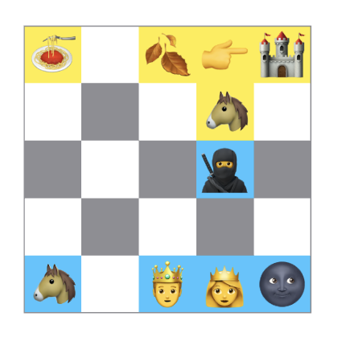

# More Chess

Chess with randomly generated variant pieces.



Using a Clean Architecture system where updates to the board are down from the interactor to a state that is read from the view 

## Information flow

```
    ┌───────────┐                                                   
┌───► Game View │                                                   
│   └───────────┘──┐                                                
│     │ Board View │                                                
│     └────┬───────┘                                                
│          │                                                        
│          │ Drag Offset                                            
│          │ ┌────────────────────────┐  Move    ┌─────────────────┐
│          │ │                        ├──────────►                 │
│          └─►                        │          │                 │
│            │ Positioning Interactor │          │ Game Repository │
│            │                        │  Board   │                 │
│            │                        ◄──────────┤                 │
│            └────┬─────────────────┬─┘          └─────────────────┘
│                 │                 │                               
│                 │ Move positions  │                               
│                 │                 │                               
│          ┌──────▼────────────┐    │                               
│◄─────────┤ Positioning State │    │ Board update                  
│          └───────────────────┘    │                               
│                                   │                               
│                                   │                               
│               ┌───────────────────▼─────┐                         
│◄──────────────┤       Game State        │                         
                └─────────────────────────┘                                                                                                                          
```

## Ownership

```
MoreChessApp             
  ContentView            
    AppState             
      LobbyState         
      GameState          
      PositioningState   
      LayoutState        
    LobbyInteractor      
    PositioningInteractor
```
